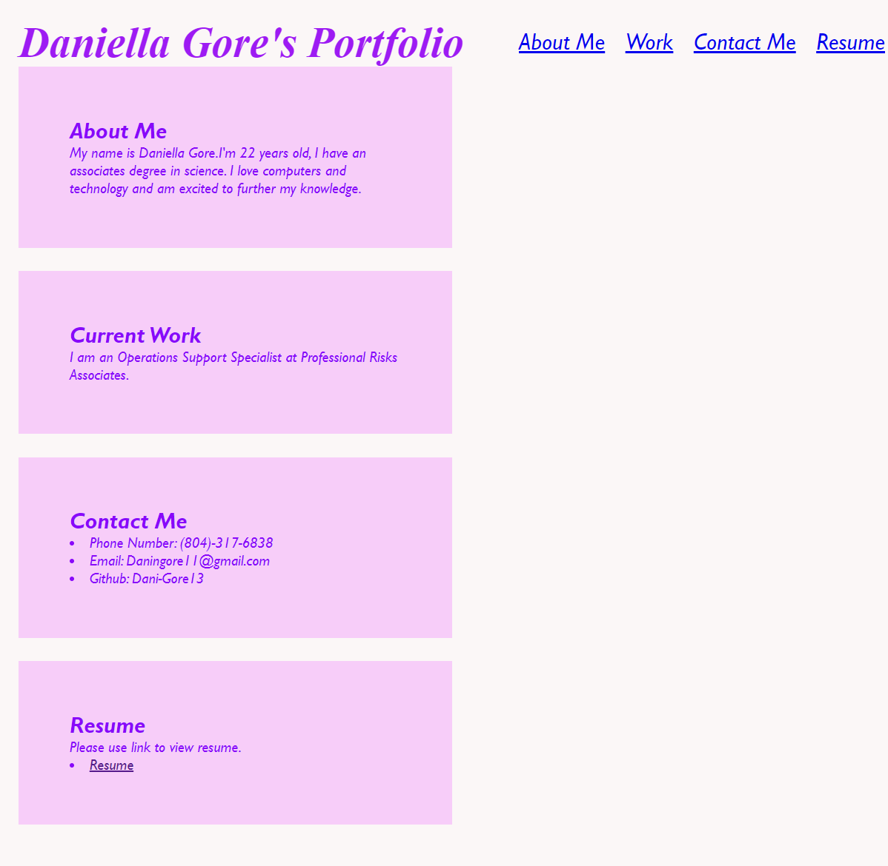

# hw2-challenge2-advanced-CSS-Portfolio

## Advanded CSS Portfolio

## Description:

- I tried to create a portfolio using HTML and CSS from scratch (unfortunetly time got the best of me.)

## What has been done:

- Information has beem added
- Links were added for each section
- Each section has a background color

## Screenshot of Portfolio:

The following image shows the portfolio:

